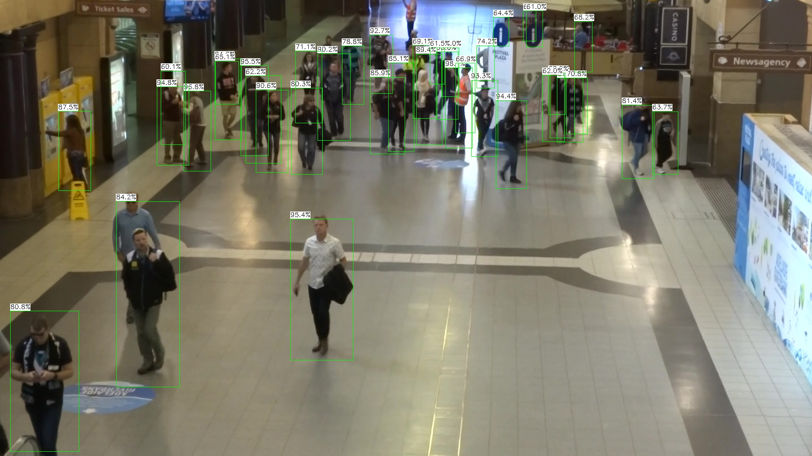
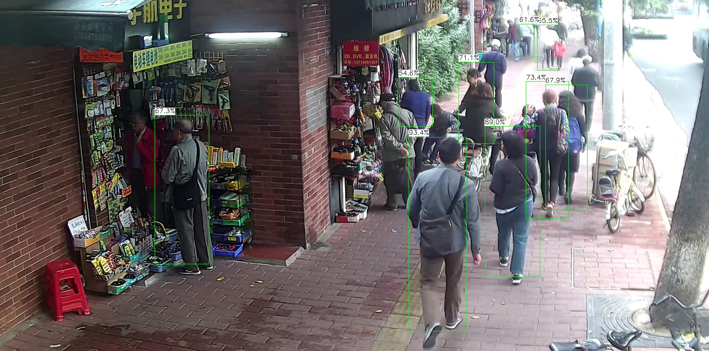

# person_detection_lite
Light-weight model with [NCNN](<https://github.com/Tencent/ncnn>) inference for person/pedestrian detection. The model is trained with [maskrcnn](<https://github.com/facebookresearch/maskrcnn-benchmark>) but not for any specified perdestrain detection dataset. You can view the model structure easily with [netron](<https://github.com/lutzroeder/netron>). The pytorch official [mobilenetv2](<https://pytorch.org/hub/pytorch_vision_mobilenet_v2/>) is used as backbone.

Not for commercial use because the performance is quit poor >.<. 

## Demo images

## Usages

- Specified the model path and shape(should be divisible by 32) for input image in the file. Put into the NCNN/example and build. 

- Anchors are build once for the model, which assumes the input shape remains the same.

